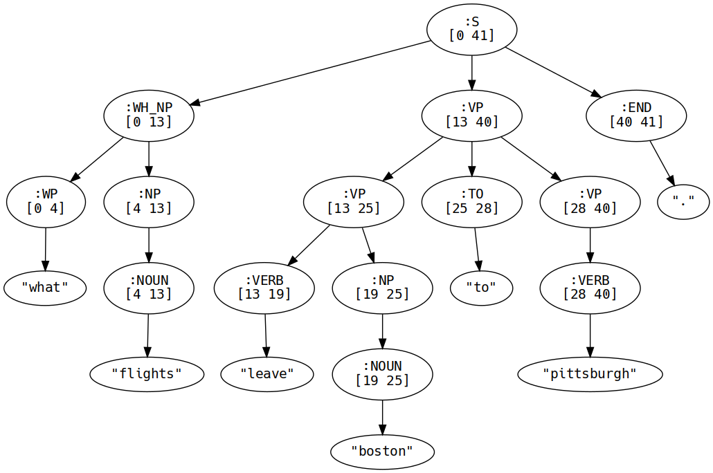

<center>
<h1>SNLP Assignment 5</h1>
<h5>Clemens Damke - 7011488</h5>
</center>

<style>
	li {
		page-break-inside: avoid;
	}
	.img {
		display: flex;
		page-break-inside: avoid;
		page-break-before: avoid;
		justify-content: center;
	}
	.img * {
		width: 45%;
		height: 45%;
	}
	
	h1, h2, h4, h5 {
		page-break-after: avoid;
	}
	
	ul, pre {
		page-break-before: avoid;
	}
</style>

## 1. Context Free Grammars

#### 1.1. POS-Tags

* `what_WDT flights_NNS leave_VBP boston_NN to_TO pittsburgh_NN ._.`
* `what_WDT flights_NNS leave_VBP los_NNS angeles_NNS arriving_VBG in_IN minneapolis_NN ._.`
* `what_WDT flights_NNS are_VBP available_JJ between_IN chicago_NNP and_CC indianapolis_NNP ._.`

#### 1.2. Context Free Grammar

```js
S ::= NP VP END | VP END | WH_NP VP END
NP ::= NOUN | NP GP | NP CC NP
VP ::= VERB | VERB NP | VERB PP | VERB NP PP | BE GP | BE AP | VP TO VP | VP CC VP
GP ::= GERUND | GERUND NP | GERUND PP | GERUND NP PP
AP ::= ADJ | ADJ PP
WH_NP ::= WP NP
PP ::= PREP NP
WP ::= 'what'
CC ::= 'and'
NOUN ::= 'flights' | 'boston' | 'pittsburgh' | 'los angeles'
       | 'minneapolis' | 'chicago' | 'indianapolis'
VERB ::= 'leave' | 'pittsburgh' | 'indianapolis'
GERUND ::= 'arriving'
BE ::= 'are'
TO ::= 'to'
PREP ::= 'in' | 'to' | 'between'
ADJ ::= 'available'
END ::= '.' | '?'
```

#### 1.3. CFG Parse Trees

* `what flights leave boston to pittsburgh .`
	<div class="img">
		
	</div>
* `what flights leave los angeles arriving in minneapolis .`
	<div class="img">
		
	</div>
* `what flights are available between chicago and indianapolis .`
	<div class="img">
		
	</div>

#### 1.4. Chomsky Normal Form

##### 1.4.1. CNF Grammar
```js
S ::= X1 END | VP END | VERB END
X1 ::= NP VP | NOUN VP | WH_NP VP | NP VERB | NOUN VERB | WH_NP VERB
NP ::= NP GP | NP X2 | NOUN GP | NOUN X2 | NP GERUND | NOUN GERUND
X2 ::= CC NP | CC NOUN
VP ::= VERB NP | VERB NOUN | VERB PP | VERB X3 | BE GP | BE GERUND
     | BE AP | BE ADJ | VP X4 | VERB X4
X3 ::= NP PP | NOUN PP
X4 ::= TO VP | TO VERB | CC VP | CC VERB
GP ::= GERUND NP | GERUND PP | GERUND X3
AP ::= ADJ PP
WH_NP ::= WP NP | WP NOUN
PP ::= PREP NP | PREP NOUN
WP ::= 'what'
CC ::= 'and'
NOUN ::= 'flights' | 'boston' | 'pittsburgh' | 'los angeles'
       | 'minneapolis' | 'chicago' | 'indianapolis'
VERB ::= 'leave' | 'pittsburgh' | 'indianapolis'
GERUND ::= 'arriving'
BE ::= 'are'
TO ::= 'to'
PREP ::= 'in' | 'to' | 'between'
ADJ ::= 'available'
END ::= '.' | '?'
```

##### 1.4.2. CNF Parse Trees
* `what flights leave boston to pittsburgh .`
	<div class="img">
		
	</div>
* `what flights leave los angeles arriving in minneapolis .`
	<div class="img">
		
	</div>
* `what flights are available between chicago and indianapolis .`
	<div class="img">
		
	</div>
